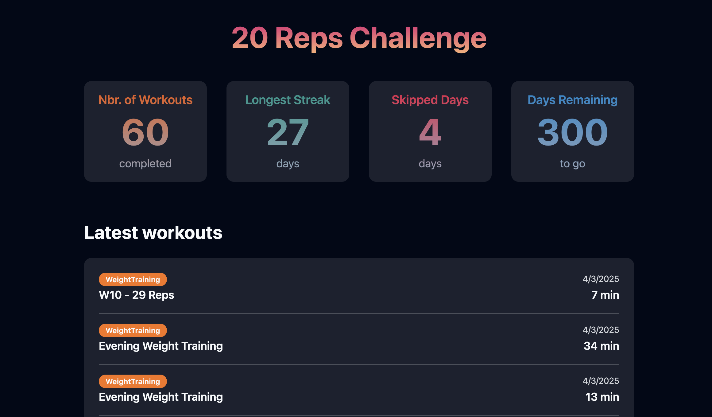

# 20 Reps
Grab your activities from Strava and start tracking your fitness progress.




## Tech Stack 
Built using SvelteKit and Cloudflare

```
npm create cloudflare@latest -- 20-reps --framework=svelte
```

It uses:
- typescript
- tailwindcss
- prettier
- eslint
- sveltekit-adapter
- paraglide

> More info regarding the setup can be found [here](./svelte-cli.md)

Additionally, it uses [shadcn-svelte components](https://next.shadcn-svelte.com/) to build all the components.
